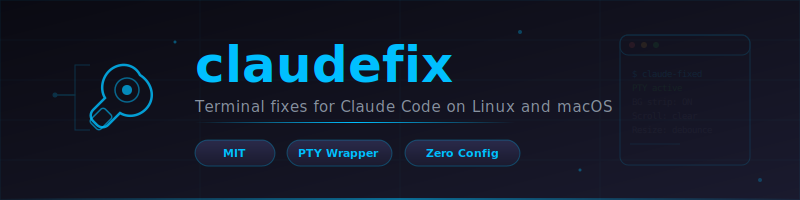
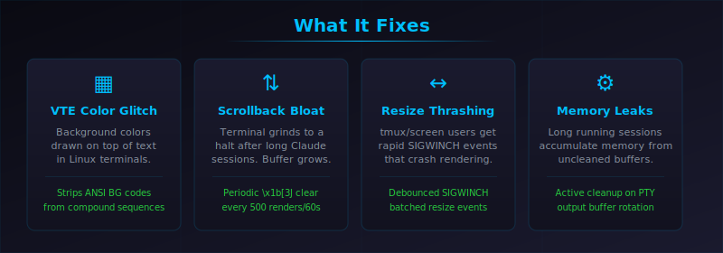
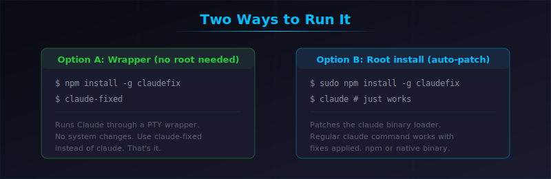
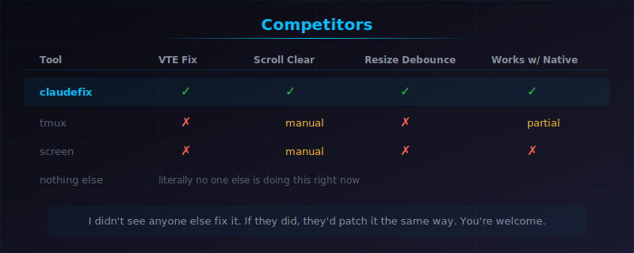
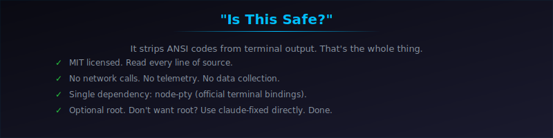

<p align="center">
  
</p>

**Developed by [Hardwick Software Services](https://justcalljon.pro/)**

---

<p align="center">
  
</p>

## The Problem

Claude Code uses Ink (React for terminals) and ships as a compiled binary. On Linux, VTE-based terminals render ANSI background colors on top of text instead of behind it. Long sessions bloat scrollback until your terminal crawls. Resize events from tmux/screen fire so fast they crash the renderer.

Anthropic hasn't fixed any of this. Been months. So here we are.

## How It Works

We spawn Claude inside a PTY (pseudo-terminal) and filter its output in real time:

1. **Strip background colors** from ANSI escape sequences that cause VTE rendering bugs
2. **Clear scrollback** every 500 renders or 60 seconds (`\x1b[3J` - the sequence Anthropic should be using)
3. **Debounce resize events** so tmux/screen users don't get cooked by SIGWINCH spam

Works with both the npm-installed Claude CLI and the native self-updating binary at `~/.local/share/claude/versions/`. Detects which one you have and patches accordingly.

---

<p align="center">
  
</p>

## Install

**No root required:**
```bash
npm install -g claudefix
claude-fixed
```

**With root (patches claude directly):**
```bash
sudo npm install -g claudefix
claude  # just works, fixes applied automatically
```

Don't want root? Use the wrapper. Want it seamless? Use root. It's that easy.

### No sudo at all?

```bash
mkdir -p ~/.npm-global
npm config set prefix '~/.npm-global'
echo 'export PATH=~/.npm-global/bin:$PATH' >> ~/.bashrc
source ~/.bashrc
npm install -g claudefix
claude-fixed
```

---

<p align="center">
  
</p>

## Competitors

None. Literally nobody else has shipped a fix for this. tmux and screen don't solve the VTE color bug - they just add their own layer of rendering problems on top. The scrollback bloat and resize thrashing are Claude Code specific. I didn't see anyone else patch it, and if someone did, they'd do it the same way: PTY wrapper, strip the codes, clear the buffer. You're welcome.

---

<p align="center">
  
</p>

## "Is This Safe?"

Wild that a package which strips ANSI codes from terminal output gets more safety scrutiny than tools that expose your machine to the open internet. But sure, let's address it:

- **MIT licensed.** Every line of source is right here. Read it.
- **No network calls.** Zero. None. No telemetry, no analytics, no phoning home.
- **One dependency:** `node-pty` - the standard Node.js pseudo-terminal binding. That's the entire dependency tree.
- **Root is optional.** If `sudo npm install -g` scares you, run `npm install -g claudefix` without sudo and use `claude-fixed` instead. Same fixes, zero system modifications.

The root install patches Claude's loader to run through the PTY wrapper automatically. The non-root install gives you a separate `claude-fixed` binary. Pick whichever you're comfortable with.

## Config

| Env Var | What It Does | Default |
|---------|-------------|---------|
| `CLAUDEFIX_DISABLED` | Set to `1` to bypass all fixes | off |
| `CLAUDEFIX_DEBUG` | Set to `1` for debug output | off |
| `CLAUDEFIX_NO_FOOTER` | Set to `1` to hide the status footer | off |
| `CLAUDEFIX_NO_DARKMODE` | Set to `1` to skip dark mode detection | off |
| `CLAUDEFIX_MEM_PERCENT` | V8 heap limit as % of system RAM | 35 |
| `CLAUDEFIX_CPU_PERCENT` | CPU throttle percent (0 = disabled) | 0 |
| `CLAUDEFIX_NUCLEAR` | Set to `1` to force max ANSI stripping | off |
| `CLAUDE_STRIP_BG_COLORS` | Set to `0` to keep background colors | on |

claudefix also reads standard terminal env vars (`VTE_VERSION`, `TERM_PROGRAM`, `TERM`, etc.) to detect your terminal emulator and apply the right fixes. For the full list of Claude Code's internal runtime variables and hook system, see the [MCP Runtime Guide](https://github.com/jonhardwick-spec/mcp-runtime-guide).

## For Anthropic / Claude Devs

This is MIT licensed on purpose. If you want to take this fix and put it directly into Claude Code, go ahead. The core fix is straightforward:

1. Add `\x1b[3J` to your terminal clear sequence
2. Strip ANSI background colors on Linux VTE terminals
3. Debounce SIGWINCH events

Three changes. Would take maybe an afternoon to integrate. The Linux terminal bugs have been reported by users for months. Happy to help if you want to chat about it.

## Links

- **npm:** [claudefix](https://www.npmjs.com/package/claudefix)
- **Author:** [Hardwick Software Services](https://justcalljon.pro/)
- **Related:** [SpecMem](https://github.com/jonhardwick-spec/specmem) - Persistent memory for Claude Code

## License

MIT - do whatever you want with it.
